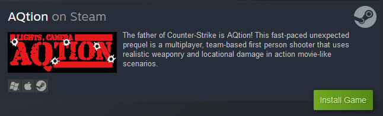

   

  
---
# AQtion Base Installation

## License considerations
Every effort has been made to ensure that no licensed, copyrighted and/or trademarked content exists in this distribution.  We abide by the license imposed by id software upon the Quake II source code, and its application upon the modification 'Action Quake 2' to redistribute the source along with the application stipulated under **TERMS AND CONDITIONS FOR COPYING, DISTRIBUTION AND MODIFICATION**

https://www.gnu.org/licenses/old-licenses/gpl-2.0.en.html

- Quake II source code: https://github.com/skullernet/q2pro (Game Engine)
- Action Quake source code: https://github.com/aq2-tng/aq2-tng (Action Quake Libraries)
- The worldwide community of contributors over the decades: (Action Quake Content)

Should it be determined that assets included in this distribution are indeed unlicensed for use, the maintainers of this repository will make expedited and thorough adjustments to this distribution repository to remove said assets and replace with appropriate content.  Please leave a message as a Github Issue containing links and references to the content, and we will respond as soon as we can.

## Requirements
* 64-bit Windows Vista, 7, 8, 10 and probably 11 are all compatible
* Mac OS 10.7+ (Intel and Apple Silicon supported)
* 64-bit x86 and ARM Linux with a video card and sound card
* Video card compatible with OpenGL 3 drivers
### Notes
* We do not provide direct support for running Quake II as there are over 20 years of forum posts and articles on how to use it, but if you are running into problems with this specific release, contact us
* If there's a special request for 32-bit Linux or something, open an Issue!

---

## Instructions/Installation

### Steam

*It is highly recommended to use the Steam installer, it is free and will update on its own with the most recent content and features.*

---

### Existing Quake II installations
1. Download the aqtion-content zip file and extract the `action` directory into the same directory where `baseq2` exists (in the same directory as your Quake II executable)
1. To start Quake II under the `action` mode, use the following startup parameters: `+set game action`
1. ***Note:*** Config files from your `baseq2` directory will still execute, so there may be some unexpected binds or cvars set

---

### Standalone Install
While these installs are available, they are not the recommended method.  Use at your own inconvenience.

#### Itch.io
* [Itch.io](https://aqtion.itch.io/aqtion)

#### Windows
1. Download the latest release zip file
1. Extract to anywhere on your machine you would like it to be permanently installed
1. Launch `q2pro.exe`

#### Linux (Deb Install)
1. Download the `.deb` install and run AQtion from your Games Menu, or:
1. Download the `.deb` install and from your Terminal, run `aqtion`
1. Use `aqtion help` for additional commands if needed

#### Linux (Tarball install)
1. Download the latest release tarball file for your architecture (`amd64 - x86` or `arm64 - aarch64`)
1. Extract to `~/aqtion` (`/home/YOUR_USERNAME/aqtion`)
1. In your Terminal, navigate to the extracted directory and launch `q2pro`

#### Need help or have questions?
1. Join us in [Discord](https://discord.aq2world.com)
1. Check out the [Steam guides](https://steamcommunity.com/app/1978800/guides/)

---

## Contact
* Github Issues in this repository
* [Discord](https://discord.aq2world.com) ask for @Mods

## Contribute
1. Fork this repository
1. Checkout a new branch
1. Commit your modifications/additions
1. Submit pull request

## Links
* [AQ2World](https://www.aq2world.com)
* [AQtiongame](https://www.aqtiongame.com)
* [AQ2Suomi](https://www.aq2suomi.com)
* [Forums](https://forums.aq2world.com)

## Credits
* [id Software](https://www.idsoftware.com) who created the original Quake II engine and brought upon us many endless nights of fragging, gibbing and lagging until our parents told us to go to bed
* The [original A-Team](http://assets.aq2world.com/archive/websites/action.telefragged.com/) who designed, coded and tested this awesome mod
* The [TNG team](http://aq2-tng.sourceforge.net/) who took over the project after 1.52 and had maintained and updated it till 2011
* The [AQDT team](https://assets.aq2world.com/archive/websites/aqdt.fear.net/) who created their own variant and produced Espionage Tournament Edition
* [Skuller](https://skuller.net/q2pro/) for the highly-acclaimed [q2pro](https://github.com/skullernet/q2pro)
* [Raptor007](https://github.com/raptor007) and [hifi](https://github.com/hifi) who have [taken over development](https://github.com/aq2-tng/aq2-tng) after the TNG team, and all forked repos who continuously improve this repository
* [Reki](https://github.com/Iceman12k) for his development contributions (and Midnight Guns!)
* [ReKTeK](https://github.com/ReKTeK) for his development contributions
* [hifi](https://github.com/hifi) for q2admin, LUA and MVD support and all forked repos who continuously improve this repository
* Mappers [stan0x](https://github.com/stan0x), **Quimby**, [WizardExt](https://www.wizardext.se/), **WetWired**, **Beavisss**, [pauhi](https://github.com/Ntuk) and **Ruskprick** for the included maps in this distribution
* [Jehar](https://twitter.com/Jehar) and the amazing folks at [Tastyspleen](http://tastyspleen.net/) and [TastyspleenTV](twitch.tv/tastyspleentv) on Twitch for broadcasting some amazing events and being the cornerstone of Quake II gaming
* The [AQ2World Discord mod team](https://discord.aq2world.com) for assisting, testing and contributing to this distribution, and keeping the scene alive
* Every single mapper, sound designer, texture creator, model maker, skin artist and community contributor to this project since its inception in the late 90s, without your 600+ maps and gigabytes of content, we'd still be playing vanilla Q2.
* All past, present and future players who for we do this all for, please keep the scene alive!
* The unforgotten and likely uncontactable community members who built and maintained sites to promote the mod and the community, your sites will be forever archived at [AQ2World](https://www.aq2world.com)
    * [Action Quake Map Depot](https://assets.aq2world.com/archive/websites/aqmd.telefragged.com/)
    * [The Newbie's Niche](https://assets.aq2world.com/archive/websites/www.actiongames.co.uk/tnn)
    * [Action World](https://assets.aq2world.com/archive/websites/aw.telefragged.com)
    * [Actor's Guild](https://assets.aq2world.com/archive/websites/guild.action-web.net)
    * [AQ Spinoffs](https://assets.aq2world.com/archive/websites/aqmods.telefragged.com)
    * [Mr. Ska's Pro Shop](https://assets.aq2world.com/archive/websites/proshop.fear.net)
    * [AQ: Gangsters](https://assets.aq2world.com/archive/websites/www.planetquake.com/gangsters)

## Asset Credits
* **Black Monk** and the [Reaction Quake 3](https://rq3.com/) [team](https://github.com/ReactionQuake3/reaction) for allowing us to use some of their assets for our content updates
* Sounds:
    * Creative Commons 0
        * https://freesound.org/people/nioczkus/sounds/396331/
        * https://freesound.org/people/pawsound/sounds/154841/
        * https://freesound.org/people/Rodzuz/sounds/393901/
        * https://freesound.org/people/unfa/sounds/199526/
    * Attribution 4.0
        * https://freesound.org/people/Benboncan/sounds/81970/
        * https://freesound.org/people/artchoma/sounds/456524/
